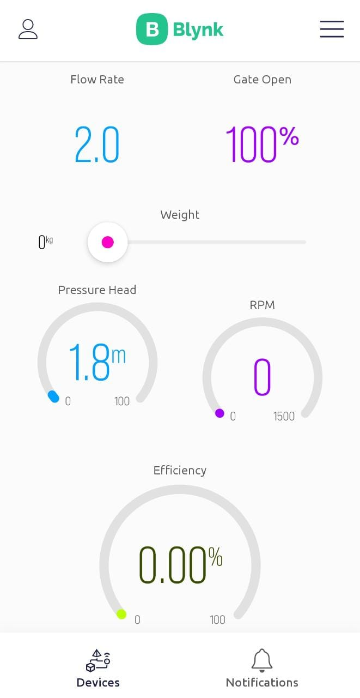
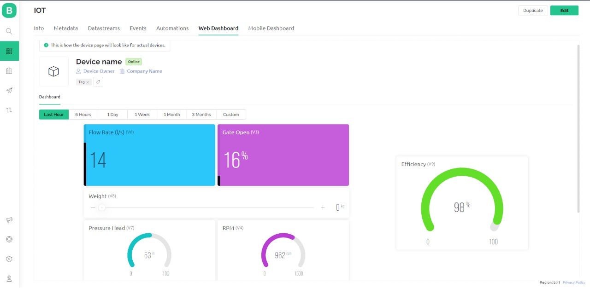

# Integration of IoT and AR for Pelton Wheel Turbine experiment

This project involved integrating IoT and Augmented Reality (AR) to enhance the Pelton Wheel Turbine experiment. High-pressure electrical sensors were connected to the turbine, alongside additional sensors to gather input data. This data was transmitted to the Blynk IoT platform via the ESP 8266 NodeMCU and Arduino, which also calculated the turbine's efficiency. All parameters were visualized on both a mobile/web application via Blynk and on an overlaid AR model of the turbine, providing an interactive and comprehensive view of the turbine's performance.

